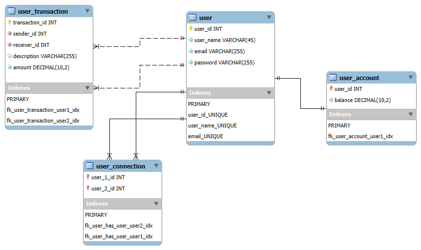

# Pay My Buddy

Pay My Buddy is a Java Spring Boot web application that allows users to easily transfer money between friends. This project was developed as part of the OpenClassrooms Java Development course.

## 📚 Table of Contents

- [Features](#features)
- [Technologies](#technologies)
- [Installation](#installation)
- [Running the Application](#running-the-application)
- [Project Structure](#project-structure)
- [Pages](#pages)

---

## ✅ Features

- User Authentication and Management
    - Register new account
    - Login/Logout functionality
    - Profile management with email/password update
- Money Transfer System
    - Easy transfer interface
    - Transaction history tracking
- Connection Management
    - Add friends using their email
    - View friends list

---

## 🛠️ Technologies

- Java 17+
- Spring Boot
- Spring Security
- Spring Data JPA
- Thymeleaf
- MySQL
- Maven
- HTML/CSS

---

## 🚀 Installation

1. **Clone the project**
   ```bash
   git clone https://github.com/Kappa6103/P6_pay_my_buddy.git
   cd pay-my-buddy
   ```

2**Build the project**
   ```bash
   mvn clean install
   ```
---

## ▶️ Running the Application

1. **Configure the MySQL DataBase**

The connection to the Database can be with environment variables or you can add this lines to the application.properties file : 
```
spring.datasource.username=your_username
spring.datasource.password=your_pwd
```

You can run the application in test environment like so : 

```
#Environment Production :
#spring.datasource.url=jdbc:mysql://localhost:3306/pay_my_buddy?serverTimezone=UTC

#Environmnent Test :
spring.datasource.url=jdbc:mysql://localhost:3306/pay_my_buddy_test?serverTimezone=UTC
spring.sql.init.data-locations=classpath:BDD/data_test.sql
spring.sql.init.mode=always
```

Three mock users are in the DDB, you can connect to their accounts with the credentials : 
```
email = "user1@gmail.com" | pwd = "password"
email = "user2@gmail.com" | pwd = "password"
email = "user3@gmail.com" | pwd = "password"

```

and production like so : 
```
#Environment Production :
spring.datasource.url=jdbc:mysql://localhost:3306/pay_my_buddy?serverTimezone=UTC

#Environmnent Test :
#spring.datasource.url=jdbc:mysql://localhost:3306/pay_my_buddy_test?serverTimezone=UTC
#spring.sql.init.data-locations=classpath:BDD/data_test.sql
#spring.sql.init.mode=always
```

2**Start the application**
   ```bash
   mvn spring-boot:run
   ```

3. **Access the application**
```bash
    URL: http://localhost:8080
```
---

## 📁 **Physical Data Model** (PDM)



Check out the MySQL script in the folder : [BDD](src/main/resources/BDD)

```sql
-- MySQL Workbench Forward Engineering

SET @OLD_UNIQUE_CHECKS=@@UNIQUE_CHECKS, UNIQUE_CHECKS=0;
SET @OLD_FOREIGN_KEY_CHECKS=@@FOREIGN_KEY_CHECKS, FOREIGN_KEY_CHECKS=0;
SET @OLD_SQL_MODE=@@SQL_MODE, SQL_MODE='ONLY_FULL_GROUP_BY,STRICT_TRANS_TABLES,NO_ZERO_IN_DATE,NO_ZERO_DATE,ERROR_FOR_DIVISION_BY_ZERO,NO_ENGINE_SUBSTITUTION';

-- -----------------------------------------------------
-- Schema pay_my_buddy
-- -----------------------------------------------------

-- -----------------------------------------------------
-- Schema pay_my_buddy
-- -----------------------------------------------------
CREATE SCHEMA IF NOT EXISTS `pay_my_buddy` DEFAULT CHARACTER SET utf8 ;
USE `pay_my_buddy` ;

-- -----------------------------------------------------
-- Table `pay_my_buddy`.`user`
-- -----------------------------------------------------
CREATE TABLE IF NOT EXISTS `pay_my_buddy`.`user` (
  `user_id` INT NOT NULL AUTO_INCREMENT,
  `user_name` VARCHAR(45) NOT NULL,
  `email` VARCHAR(255) NOT NULL,
  `password` VARCHAR(255) NOT NULL,
  PRIMARY KEY (`user_id`),
  UNIQUE INDEX `user_id_UNIQUE` (`user_id` ASC) VISIBLE,
  UNIQUE INDEX `user_name_UNIQUE` (`user_name` ASC) VISIBLE,
  UNIQUE INDEX `email_UNIQUE` (`email` ASC) VISIBLE)
ENGINE = InnoDB;


-- -----------------------------------------------------
-- Table `pay_my_buddy`.`user_transaction`
-- -----------------------------------------------------
CREATE TABLE IF NOT EXISTS `pay_my_buddy`.`user_transaction` (
  `transaction_id` INT NOT NULL AUTO_INCREMENT,
  `sender_id` INT NOT NULL,
  `receiver_id` INT NOT NULL,
  `description` VARCHAR(255) NULL,
  `amount` DECIMAL(10,2) NOT NULL,
  PRIMARY KEY (`transaction_id`),
  INDEX `fk_user_transaction_user1_idx` (`sender_id` ASC) VISIBLE,
  INDEX `fk_user_transaction_user2_idx` (`receiver_id` ASC) VISIBLE,
  CONSTRAINT `fk_user_transaction_user1`
    FOREIGN KEY (`sender_id`)
    REFERENCES `pay_my_buddy`.`user` (`user_id`)
    ON DELETE NO ACTION
    ON UPDATE NO ACTION,
  CONSTRAINT `fk_user_transaction_user2`
    FOREIGN KEY (`receiver_id`)
    REFERENCES `pay_my_buddy`.`user` (`user_id`)
    ON DELETE NO ACTION
    ON UPDATE NO ACTION)
ENGINE = InnoDB;


-- -----------------------------------------------------
-- Table `pay_my_buddy`.`user_account`
-- -----------------------------------------------------
CREATE TABLE IF NOT EXISTS `pay_my_buddy`.`user_account` (
  `user_id` INT NOT NULL,
  `balance` DECIMAL(10,2) NOT NULL,
  PRIMARY KEY (`user_id`),
  INDEX `fk_user_account_user1_idx` (`user_id` ASC) VISIBLE,
  CONSTRAINT `fk_user_account_user1`
    FOREIGN KEY (`user_id`)
    REFERENCES `pay_my_buddy`.`user` (`user_id`)
    ON DELETE NO ACTION
    ON UPDATE NO ACTION)
ENGINE = InnoDB;


-- -----------------------------------------------------
-- Table `pay_my_buddy`.`user_connection`
-- -----------------------------------------------------
CREATE TABLE IF NOT EXISTS `pay_my_buddy`.`user_connection` (
  `user_1_id` INT NOT NULL,
  `user_2_id` INT NOT NULL,
  PRIMARY KEY (`user_1_id`, `user_2_id`),
  INDEX `fk_user_has_user_user2_idx` (`user_2_id` ASC) VISIBLE,
  INDEX `fk_user_has_user_user1_idx` (`user_1_id` ASC) VISIBLE,
  CONSTRAINT `fk_user_has_user_user1`
    FOREIGN KEY (`user_1_id`)
    REFERENCES `pay_my_buddy`.`user` (`user_id`)
    ON DELETE NO ACTION
    ON UPDATE NO ACTION,
  CONSTRAINT `fk_user_has_user_user2`
    FOREIGN KEY (`user_2_id`)
    REFERENCES `pay_my_buddy`.`user` (`user_id`)
    ON DELETE NO ACTION
    ON UPDATE NO ACTION)
ENGINE = InnoDB;


SET SQL_MODE=@OLD_SQL_MODE;
SET FOREIGN_KEY_CHECKS=@OLD_FOREIGN_KEY_CHECKS;
SET UNIQUE_CHECKS=@OLD_UNIQUE_CHECKS;

```

---

## 📁 Project Structure (MVC)
```
src
├── main
│   └── java
│   |   └── com.paymybuddy
│   |       ├── configuration
│   |       ├── controller
│   |       ├── model
│   |       │   ├── dto
│   |       ├── repository
│   |       └── service
│   └── resources
│       ├── static
│       │   └── css
│       └── templates
└── test
    └── java
        └── com.paymybuddy
            ├── controller
            └── service

```

---

## 📱 Pages

### 🔐 Authentication Pages
- **Login Page**: User authentication
- **Registration Page**: New user registration

### 💼 Main Features
- **Transfer Page**: Send money to friends
    - Select friend from dropdown
    - Enter amount and description
    - View transaction history
- **Profile Page**: Manage user information
    - Update username
    - Change email
    - Modify password
- **Connection Page**: Manage friends
    - Add new connections

---

## 🔐 Security Features

- Password encryption
- Session management
- CSRF protection
- Form validation
- Transaction security

---

## 📫 Educational Context

This project was developed as part of the OpenClassrooms Java Development course, focusing on:
- Spring Boot application development
- Database design and implementation
- Security implementation
- Transaction management
- MVC architecture
- Clean code principles

---

## 👤 Author

[Kevin Schade] - OpenClassrooms Student
